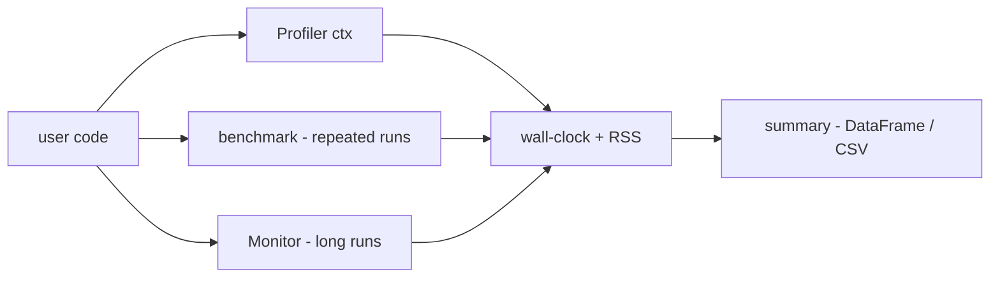

# scitex-benchmark

<p align="center">
  <a href="https://scitex.ai">
    
  </a>
</p>

<p align="center"><b>Performance benchmarking, runtime monitoring, and profiling helpers.</b></p>

<p align="center">
  <a href="https://scitex-benchmark.readthedocs.io/">Full Documentation</a> · <code>uv pip install scitex-benchmark[all]</code>
</p>

<!-- scitex-badges:start -->
<p align="center">
  <a href="https://pypi.org/project/scitex-benchmark/"></a>
  <a href="https://pypi.org/project/scitex-benchmark/"></a>
  <a href="https://github.com/ywatanabe1989/scitex-benchmark/actions/workflows/test.yml"></a>
  <a href="https://codecov.io/gh/ywatanabe1989/scitex-benchmark"></a>
  <a href="https://scitex-benchmark.readthedocs.io/en/latest/"></a>
  <a href="https://www.gnu.org/licenses/agpl-3.0"></a>
</p>
<!-- scitex-badges:end -->

---

## Installation

```bash
pip install scitex-benchmark
```

## Architecture

```
src/scitex_benchmark/
├── benchmark.py     # high-level benchmark() runner + statistical comparisons
├── profiler.py      # Profiler context manager (wall-clock + memory)
├── monitor.py       # long-running resource monitor (CPU/RAM/GPU)
└── _skills/         # SciTeX skills metadata
```

## Demo



## Quick Start

```python
import scitex_benchmark as sb

# Single-function benchmark
result = sb.benchmark_function(
    my_func,
    args=(my_input,),
    iterations=20,
    warmup=2,
)
print(f"{result.function_name}: {result.mean_time:.3f}s ± {result.std_time:.3f}s")

# Compare two implementations
df = sb.compare_implementations(
    implementations={"v1": impl_a, "v2": impl_b},
    test_data_generator=lambda: ((input,), {}),
)
print(df)
```

## 1 Interfaces

<details open>
<summary><strong>Python API</strong></summary>

<br>

```python
import scitex_benchmark as sb

# Benchmark suite — time across input sizes
suite = sb.BenchmarkSuite("io")
suite.add_benchmark(my_func, gen_input, "name", sizes=["1MB", "10MB"])
results = suite.run()

# Performance monitor — track CPU/RAM/error metrics over time
monitor = sb.PerformanceMonitor()
monitor.start()
long_running_job()
stats = monitor.get_stats()

# Profiler decorator — cProfile instrumentation
@sb.profile_function
def hot_function(x):
    return x ** 2
```

</details>

## Status

Standalone fork of `scitex.benchmark`. Only dep is `psutil`. The umbrella
package's `scitex.benchmark` import path is preserved via a `sys.modules`-alias
bridge. Convenience builders inside `benchmark.py` import `scitex.io`/`scitex.stats`
*lazily* if you opt in — without those installed they simply error out at
the call site, but the core API works without them.

## Part of SciTeX

`scitex-benchmark` is part of [**SciTeX**](https://scitex.ai). Install via
the umbrella with `pip install scitex[benchmark]` to use as
`scitex.benchmark` (Python) or `scitex benchmark ...` (CLI).

>Four Freedoms for Research
>
>0. The freedom to **run** your research anywhere — your machine, your terms.
>1. The freedom to **study** how every step works — from raw data to final manuscript.
>2. The freedom to **redistribute** your workflows, not just your papers.
>3. The freedom to **modify** any module and share improvements with the community.
>
>AGPL-3.0 — because we believe research infrastructure deserves the same freedoms as the software it runs on.

## License

AGPL-3.0-only (see [LICENSE](./LICENSE)).

---

<p align="center">
  <a href="https://scitex.ai" target="_blank"></a>
</p>
